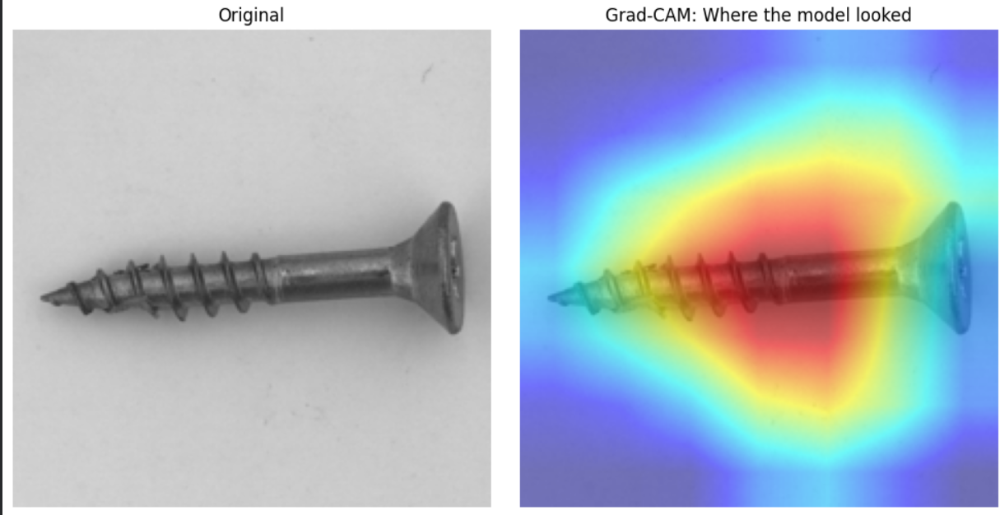

# BoltGuard AI — Screw Defect Detection

A computer vision system that classifies screws as **good** or **defective** from images, with visual explainability (Grad-CAM) and a deployed two-page inspection dashboard. Built as an end-to-end ML engineering exercise: dataset curation, iterative model development, a real data bug found and fixed mid-project, evaluation beyond accuracy, and a working live demo — not just a notebook.

**[Live demo →](https://digiryte-challenge2-screw-defect-qc-mxb6t65jnghfannhkwduvt.streamlit.app/)** &nbsp;|&nbsp; **[Notebook →](https://github.com/harinipalanisamy-krishna/digiryte-challenge2-screw-defect-qc/blob/main/Digiryte_Challenge2_ScrewQC_v2%20%282%29.ipynb)** &nbsp;|&nbsp; ResNet18 · PyTorch · Streamlit · Grad-CAM


*A defective screw with its Grad-CAM attention overlay, as shown on the Inspect page.*

---

## Why This Project

Visual quality control is one of the most common real-world applications of computer vision, and one of the most unforgiving: a missed defect can mean a faulty product reaches a customer, while too many false alarms erode trust in the tool and get it switched off. This project treats that tradeoff as a first-class design decision rather than an afterthought — the detection threshold, precision/recall reporting, and evaluation methodology are all built around the question *"what does a QC operator actually need from this?"*

## Problem Statement

Given an image of a screw, predict whether it is defective, and — for defective screws — highlight *where* the model believes the defect is, so a human operator can quickly verify the flag rather than treat the model as a black box.

## Dataset

**[MVTec AD](https://www.mvtec.com/company/research/datasets/mvtec-ad)** (screw category) — the field-standard academic benchmark for industrial visual anomaly detection, chosen because it's the closest publicly available proxy for a real factory QC dataset, and because strong performance here demonstrates transferability to any client with a visual inspection use case (not just this specific product).

- **~380 images** total, combining the "good" images from both the train and test splits with 5 defect-type folders (`manipulated_front`, `scratch_head`, `scratch_neck`, `thread_side`, `thread_top`), then re-split 80/20 with class balance preserved.

## The App

The deployed Streamlit app is a two-page dashboard, not a single upload form:

- **🔍 Inspect** — a long-form, one-screw-at-a-time view. Upload a batch or take a live photo via the browser camera; each result renders as its own card: full-size photo → verdict badge → (for defects) the Grad-CAM attention map with an explicit "approximate region, not a confirmed boundary" disclaimer.
- **📊 Dashboard** — session-wide analytics, computed live from every image inspected so far (not simulated numbers): Inspected / Passed / Defective / Defect Rate, filterable by status (All / Passed / Defective), a compact result grid, and two export buttons (`.txt` report, `.csv` defect log).

## Key Design Decisions

| Decision | Rationale | Tradeoff acknowledged |
|---|---|---|
| **Supervised classification**, not unsupervised anomaly detection | MVTec AD is primarily used for *unsupervised* anomaly detection (train on "good" images only), since real factories often have abundant good parts but scarce labeled defects. This project uses supervised learning because labeled defects were available, and supervised methods are simpler and typically more accurate when labels exist. | In a deployment with few/no labeled defects, an unsupervised method (PatchCore, PaDiM, EfficientAD) would be more appropriate — see Future Work. |
| **ResNet18** backbone | Small dataset (~380 images) + binary task → a smaller pretrained model reduces overfitting risk without sacrificing accuracy, and trains fast enough for rapid iteration. | Not benchmarked against alternative architectures (e.g. EfficientNet-B0) — a natural next experiment. |
| **Threshold tuned toward recall** | For QC, a missed defect is costlier than a false alarm, so the deployed default favors catching more defects at the cost of more false positives. | Precision on the defective class is 0.68 — explicitly tracked and reported, not hidden. |
| **Grad-CAM for explainability** | Gives the operator a visual reason to trust (or override) the model's flag, rather than a bare label. | Localization is weakly-supervised (heatmap thresholding), not pixel-precise — see Known Limitations. |
| **Two-page app instead of one long page** | Separates "look at this one result closely" (Inspect) from "how is the whole session going" (Dashboard) — mirrors how real QC operators actually use inspection tools: verify individual flags, then check shift-level stats. | Slightly more code to maintain (`common.py` shares logic between pages to avoid duplication). |

## Development Process

The model wasn't built in one pass — each stage was driven by a specific question raised by the previous result:

1. **Baseline** (no augmentation, plain split): 81.4% test accuracy vs. 100% training accuracy — a clear overfitting gap on this small dataset.
2. **Data augmentation** (flips, rotation, color jitter): improved to 84.9% test accuracy with a narrower train/test gap, confirming augmentation was addressing overfitting as intended.
3. **Hyperparameter tuning** via a single validation split initially pointed to one clear winning config — but test accuracy on that config came back similar to the baseline, which didn't match the validation signal.
4. **K-fold cross-validation** was introduced specifically to resolve that discrepancy, since a single small validation split is an unreliable way to compare configs. This gave a trustworthy final configuration.
5. **Data quality bug found and fixed**: a routine check of the training folder revealed that several MVTec defect-type folders shared identical filenames (e.g. `000.png`), which silently overwrote images when combined into one folder without renaming. Fixing this (prefixing filenames by defect type) and retraining with the *same proven approach* confirmed the data bug — not the architecture or hyperparameters — had been the real bottleneck the whole time.
6. **Evaluation beyond accuracy**: confusion matrix, precision/recall/F1, ROC-AUC and PR-AUC, and multi-threshold analysis to make the precision/recall tradeoff explicit and tunable.
7. **Grad-CAM localization investigation**: after noticing the attention heatmap sometimes didn't land on the visually obvious defect, tested both a finer feature layer (layer3 vs layer4) and a sharper CAM variant (GradCAM++ vs GradCAM) — neither moved the highlighted region. Concluded this points to the model's own learned attention (likely a small-dataset shortcut feature) rather than a fixable localization-algorithm problem; documented as a known limitation instead of over-engineering further algorithmic patches. An adaptive percentile-based threshold was still added to the bounding-box logic, since that *does* measurably reduce oversized, misleading boxes on diffuse heatmaps.
8. **Deployment**: a two-page Streamlit app (Inspect + Dashboard) with batch upload, live camera capture, Grad-CAM overlays, session-wide analytics, and downloadable TXT/CSV reports.

This debugging arc — catching a data bug that a purely metrics-driven approach would have missed, using k-fold to catch an unreliable validation signal, and knowing when a localization discrepancy is a model-attention issue rather than an algorithm bug — is arguably the most representative part of the project: it reflects the kind of diagnostic judgment that separates a model that trains from a model that's trustworthy.

## Results

| Metric | Value |
|---|---|
| Test accuracy | **~87%** |
| Recall (defective class) | **~88%** (21/24 defects caught) |
| Precision (defective class) | **0.68** |
| ROC-AUC | *[fill in]* |
| PR-AUC (Average Precision) | *[fill in]* |

Full precision/recall breakdown across thresholds, confusion matrix, and ROC/PR curves are in the notebook (`confusion_matrix.png`, `gradcam_example.png`) and reproducible standalone via `evaluate.py`.

## Architecture

```
Image upload / live camera capture (Streamlit)
        │
        ▼
 Preprocessing (resize 224×224, normalize)
        │
        ▼
 ResNet18 (ImageNet-pretrained, fine-tuned FC head)
        │
        ├──► Softmax probability ──► Threshold ──► Good / Defective label
        │
        └──► Grad-CAM (layer4, vanilla GradCAM) ──► Heatmap
                  │
                  └──► Adaptive-threshold bounding box ──► Overlay shown to operator
```
